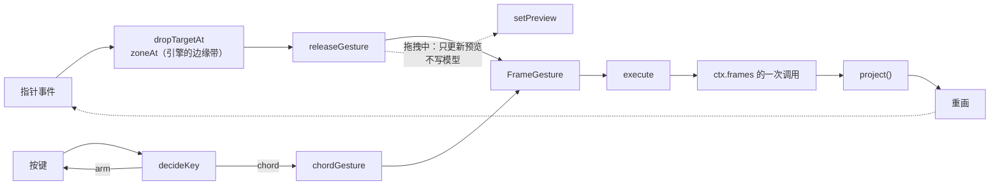
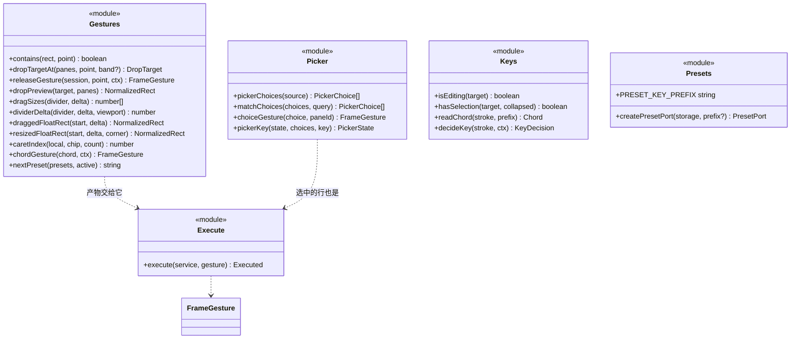

# `@deepseek-ai/dsh-client-frames-web` 设计

> **本包是渲染端。** 它把核心的投影画成界面，把指针与键位变成核心的语义操作。web 与桌面**共用这一个渲染器**——桌面版只是换了个宿主，画的是同一份代码。
> 核心见 [`../frames/DESIGN.md`](../frames/DESIGN.md)，兼容层见 [`../frames-ui-compat/DESIGN.md`](../frames-ui-compat/DESIGN.md)，三仓关系见 [`frame-manager-design.md`](../../../frame-manager-design.md)。

---

## 1. 职责边界

| | 知道什么 | **绝不知道** |
|---|---|---|
| 本包 | 把投影画成 DOM、指针命中判定、键位与手势、`localStorage` 里的预设 | 布局怎么算、治理怎么裁决、历史怎么记、`ui-layout` 的任何接口与槽键名 |

**它做三件外壳上的事**：占 `root` 座位并声明 `frames.body` 这个 keyed 内容族；声明 `frames.overlay` 这个始终绘制的覆盖层座位；把 frame 自己的几何交给每个 body。

**它做三件交互上的事**：指针 → 手势、键位 → 手势、手势 → **恰好一次**服务调用。

---

## 2. 框架图

### 2.1 模块关系

```mermaid
flowchart TB
    subgraph shell["外壳"]
        IDX["client/index.ts<br/>插件体：装服务 · 占 root · 画帧与浮层"]
    end

    subgraph lang["手势语言 —— 纯函数，脱开 DOM 可测"]
        GES["client/gestures.ts<br/>区域判定 · 夹取 · 归约成 FrameGesture"]
        KEY["client/keys.ts<br/>decideKey：这一次按键算谁的"]
        PIC["client/picker.ts<br/>候选行 · 查询排序 · 选中行"]
    end

    subgraph io["出口与介质"]
        EXE["client/execute.ts<br/>手势 → 服务调用，唯一出口"]
        PRE["client/presets.ts<br/>localStorage 的 PresetPort"]
    end

    CORE["../../../frames/src/index.ts<br/>REACT_CAPABILITIES · provideFramesService · project"]

    IDX --> GES
    IDX --> KEY
    IDX --> PIC
    IDX --> EXE
    IDX --> PRE
    GES --> CORE
    KEY --> GES : Chord
    PIC --> GES : FrameGesture
    EXE --> CORE
    PRE --> CORE

    classDef pureC fill:#1f3a2f,stroke:#5fbf7f,color:#e6e9ef
    classDef edgeC fill:#1f3a5f,stroke:#6ea8fe,color:#e6e9ef
    class GES,KEY,PIC pureC
    class EXE,PRE edgeC
```

**三条约束**：

1. **`gestures.ts` 与 `keys.ts` 是纯函数**，只读数字与标志位，所以整条交互规则可以脱开 DOM 断言。
2. **`execute.ts` 是唯一出口。** 手指或键盘都先归约成 `FrameGesture`，再由它变成**恰好一次** `ctx.frames` 调用——"一次手势一条历史"因此是构造上成立，而不是靠自觉。
3. **拖拽期间不碰模型。** 预览只活在渲染端闭包里，释放那一刻才发一次意图。

### 2.2 一次输入的路径



> **`decideKey` 判什么**：输入框里也触发快捷键，唯一的例外是"这个键在文本框里本来就在干活"——`C-x` 有选中文本时交给浏览器剪切，无选中时才进入前导等待。

---

## 3. 静态类图

```mermaid
classDiagram
    class FramesLayer {
        <<React component>>
        -Snapshot snapshot
        -NormalizedRect preview
        -Active active
        -boolean armed
        +render() Element
    }
    class Controller {
        +subscribe(listener) Function
        +getSnapshot() Snapshot
        +context(seed) GestureContext
        +seed() string
        +activePreset() string
        +remeasure() void
        +dispatch(gesture) void
    }
    class Active {
        <<union>>
        chip: session + seed
        float: paneId + corner + start + from
        divider: divider + from
    }
    class Snapshot {
        +FrameViewProjection view
    }

    class FrameGesture {
        <<union>>
        split: paneId + axis + seed
        drop: tabId + target + seed
        placeTab: tabId + paneId + index
        close: paneId
        float: paneId
        dock: paneId
        focus: direction
        focusPane: paneId
        resizeSplit: splitId + sizes
        placeFloat: paneId + rect
        savePreset: name
        applyPreset: name
        savePresetAs
    }
    class GestureContext {
        +PaneId activePaneId
        +TabId activeTabId
        +string seed
        +GesturePane[] panes
        +string[] presets
        +string activePreset
    }
    class GesturePane {
        +PaneId id
        +NormalizedRect rect
    }
    class GestureDivider {
        +SplitId splitId
        +SplitAxis axis
        +number index
        +number[] sizes
        +NormalizedRect parent
    }
    class DragSession {
        +TabId tabId
        +PaneId fromPaneId
    }
    class Chord {
        <<enumeration>>
        C-x down
        C-x right
        C-x f
        C-x d
        C-x C-d
        C-x s
        C-x C-s
        M-h / M-j / M-k / M-l
    }
    class KeyDecision {
        <<union>>
        ignore
        arm
        chord: Chord
    }
    class KeyContext {
        +boolean prefix
        +boolean editing
        +boolean selected
    }
    class PresetPort {
        <<interface>>
        +list() Promise~string[]~
        +read(name) Promise~unknown~
        +write(name, preset) Promise~void~
        +remove(name) Promise~void~
    }

    FramesLayer *-- Controller
    FramesLayer *-- Active
    FramesLayer *-- Snapshot
    Controller ..> GestureContext : 构造
    GestureContext *-- GesturePane
    GestureContext ..> FrameGesture : 输入
    FrameGesture ..> Chord
    KeyDecision ..> Chord
    Chord ..> FrameGesture : chordGesture
    DragSession ..> FrameGesture : releaseGesture
    GestureDivider ..> FrameGesture : dragSizes
    Controller ..> FrameGesture : dispatch
</diagram>
```

### 3.1 手势语言（纯函数）



> **`execute` 的返回值是 `boolean | Promise<boolean>`**：预设那两条意图背后是 IO，所以它们答得晚。但它们仍然**只调一次**服务。
>
> **两个手势要 UI 收尾，`execute` 永远不该看到它们**：
>
> - `savePresetAs`：只有 UI 能问名字，所以渲染端先解析成带名字的 `savePreset`——看到它就报告，而不是用一个没人选的名字存下去。它至今仍用浏览器 `prompt`（一个纯文本问题，没有可列举的答案）。
> - `pickContent`：`C-x b` 要的是一个**选择**，所以渲染端打开 `client/picker.ts` 的对话框（列表 + 输入过滤），选中行本身成为 `showContent` / `createContent` 之一。它一度也是 `prompt`；见本节末尾。

---

## 4. 座位与内容族

注册进 `root` 的那一条**同时声明**了两个子座位：

```ts
ctx.slots.register({
  name: 'root', id: 'frames-layer', order: 100,
  children: {
    'frames.body': { kind: 'keyed', scope: 'root' },
    'frames.overlay': { kind: 'list', scope: 'root' },
  },
}, FramesLayer)
```

**声明即独占渲染权**：`frames.body` 是一个 keyed 内容族，一个插件按自己的 frame 类型 id 提供 body，渲染端用 `renderSlot('frames.body', props, { entryKey: typeId })` 取。

交给 body 的 owner props 是核心的 `FrameBodyProps`：

| 字段 | 为什么 |
|---|---|
| `rect` | 归一化的自身面积——body 有时必须知道自己多宽（侧栏要画窄轨） |
| `viewport` | 换算成自己的单位用；核心因此不需要知道单位是什么 |
| `focused` | 这一格是否有焦点 |

### 4.1 `frames.overlay`：不依赖任何 frame 的那一层

`renderSlot('frames.overlay', {})` **无条件画一次**，位置在 pane 与分隔条之上、浮窗之下（`z-index: 2` 那一层），并且整层 `pointer-events: none`——占用者自己定位、自己把点击打开。

它的存在理由只有一条，但它是硬需求：**有些内容必须在没有任何 frame 显示它的时候继续运行**。`frames.body` 是按"画出来的那一格 pane"取的，所以一个没有视图的内容在别处无处挂载。右栏就是活例子——它的占据者要在隐藏状态下上报"我想显示了"，而那一格 frame 正是因为这条上报才存在。

这一层**不代表任何角色**：渲染端不知道谁注册进来、也不知道那是右栏。它只知道"这一层始终画"。

---

## 5. 预设介质

`localStorage`，**每条预设一笔**，前缀 `dsh.frames.preset.`。

- 分笔而不是一坨：记录本来就是逐条写、逐条读、逐条删的，而且一坨会让一条坏记录带垮全部；
- 解析失败的条目**读作不存在**而不是抛出——一个坏字节不该让整个外壳在挂载时倒下；
- `localStorage` 按**源**分仓，所以换端口 / 换浏览器 / 进桌面版都是另一套预设。代价与补法见 [`frame-manager-design.md`](../../../frame-manager-design.md) §11.3。

---

## 6. 测试

| 套件 | 守什么 |
|---|---|
| `gestures.test.ts` | 区域判定、夹取、归约、预览与释放用同一条规则、**一个手势一次调用** |
| `keys.test.ts` | 输入框内触发、`C-x` 与剪切的冲突、未绑定的键不被吞、前导只活一次按键 |
| `picker.test.ts` | 候选构成（不可实例化的类型不进列表）、空查询保留全部、四个匹配档位与排序、光标环绕且不越界、每行对应的手势 |
| `presets.test.ts` | 命名空间、坏条目读作不存在、两个 port 互不干扰 |
| `tools/client-bundle.test.ts` | 构件是 factory-CJS、只 require `react`、每个包只有一套 require 绑定、无重复声明、核心名齐全 |
| `tools/plugin-runtime.test.ts` | **在 vm 里真的跑构件**：装机、存一次、再装一次（模拟刷新）、把 body 的 owner props 抓出来断言、**断言 overlay 座位无论有没有 frame 都画一次** |

> 最后两条的区别值得说：前者把构件当**文本**读，后者把构件当**代码**跑。这个项目踩过的坑里，真正伤人的是"构件能加载但一载入就抛"和"加载了却什么都没注册"——**两种都躲得过正则**。

---

## 7. `C-x b` 的选择器

`C-x b` 要的是一个**选择**，所以它不是 `prompt`，而是一个模态对话框：一个查询框，下面是它过滤出来的行。

| 部分 | 在哪 | 为什么在那儿 |
|---|---|---|
| 行从哪来 | `pickerChoices(view)`：投影的 `contents` + 可实例化的 `types` | 渲染端不认识内容，只认识投影；核心因此不需要为这个 UI 加任何东西 |
| 查询怎么排 | `matchChoices(choices, query)`：id/标题**完全相同** → 前缀 → 子串 → 子序列 | 人打 `dpr` 是想找 `document-preview`，打 `doc` 是想让文档预览排第一；同档保持列表原序，列表不会在光标下重排 |
| 光标怎么动 | `pickerKey(state, choices, key)`：↑↓ 环绕，且始终被夹在**过滤后**的列表里 | 过滤让列表变短时，光标不能留在末尾之外 |
| 选一行做什么 | `choiceGesture(choice, paneId)`：`open` 组 → `showContent`；`new` 组 → `createContent` | 组就是含义，不需要猜"这个名字是已经有的还是要新造的" |

**它是模态的，而且这是刻意的。** 别处的规则是"输入框里也能用快捷键"（§2.2），因为那是为了不让人把手从键盘挪开；而这个对话框**本身就是**一次快捷键的收尾，所以它开着的期间每一次按键都属于查询：全局键层让位，对话框只留 ↑↓ / Enter / Esc（Esc 也由全局那一层兜住，因为点一下行会把焦点移出输入框）。

空 frame 里那版选择器（§4/`createPicker`）用的是同一批行与同一个 `choiceGesture`，区别只是没有地方打字。
